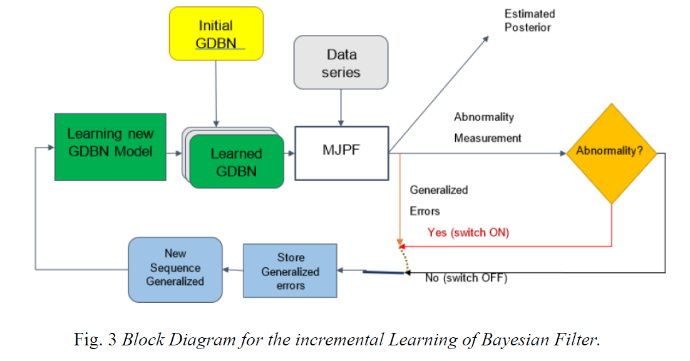

<b><h1>Cognitive data system exam </h1></b>

Jorge Leonardo Quimi Villon 

<b><h2>Introduction</h2></b>

The problem of estimating models from a reduced set of training data is relevant task that allows system to learn dynamic models. State estimation is important for motion prediction, tracking, identification of temporal patterns, autonomous vehicle and abnormality detection. We are interested in filter self-detecting abnormalities [1] of a moving agent from its trajectory data generated by a planned activity. The planned activity is a sequence of actions (or state transitions) that the agent performs to accomplish a task from a certain starting state, in a certain environment. The sequence of actions can be learned from training data grouped into discrete motion patterns. Abnormalities can be defined as observations that do not match with learned action patterns and models for abnormality detection are generally trained on a set of observations of normal activities.
Several state estimation methods have been employed for modeling linear and nonlinear dynamic. An example for Bayesian filter using a dynamic model is the Kalman Filter (𝐾𝐹), an optimal state estimator for linear dynamic system with Gaussian noise iteratively predicting and estimating states from incremental observations. The posterior probability density function (𝑃𝐷𝐹) of the continuous state in the 𝐾𝐹 is Gaussian. A Particle Filter (𝑃𝐹) allows one to manage a numerical approximation of the posterior in a nonlinear, non-Gaussian Bayesian filtering problem. 𝑃𝐹 approximates 𝑃𝐷𝐹𝑠 with a set of weighted samples (particles), which are propagated with an iterative random process. Particle are re-weighted based on dynamics and a likelihood score that depends on new observations.
In this report, we present a method to jointly learn coupled 𝐾𝐹 and 𝑃𝐹 models, which we call Markov Jump Particle Filter (𝑀𝐽𝑃𝐹), and that we use for multidimensional probabilistic anomaly measurement. As un-supervised learning method we use Self-organizing Maps (𝑆𝑂𝑀) to learn switching variables vocabulary. This report proposes a strategy to incremental learning and abnormality detection task.
figure below shows the block diagram of the proposed method.
This report is structured as follows: Section 1 presents the training and testing dataset. Section 2 presents a discussion on the training phase. section 3 results of the testing phase and section 4 shows the conclusions and possible future developments.

